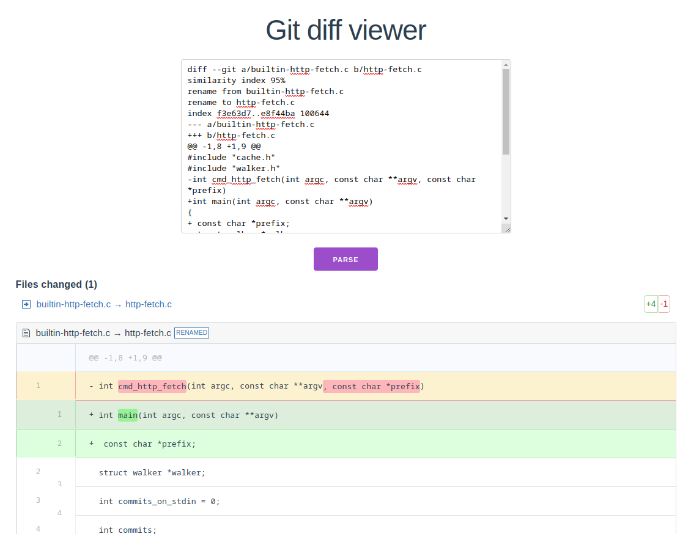

To check the service, run the following commands:
```bash
# Run server
$ cd backend && yarn install && yarn dev

# Run test
$ cd backend && yarn test

# Run client
$ cd frontend && yarn install && yarn dev
```